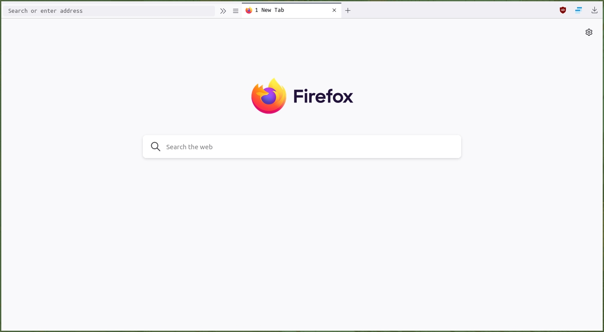

# Minimal one lined firefox

Nothing fancy just the things I like in my setup. The different css snipits are collected from several sources mentioned on subreddit [r/FirefoxCSS](https://www.reddit.com/r/FirefoxCSS/wiki/index) for colorscheme use pywallfox addon with pywal generated colorschemes.

***
## Screenshot

